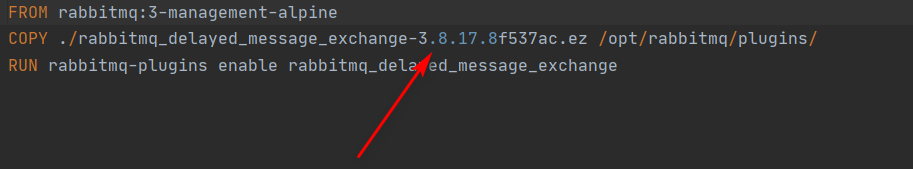

# Spring Boot RabbitMQ Delayed Message
Sample project for Spring Boot RabbitMq Delayed Message

## Docker RabbitMQ Delayed Message
Download delayed message plugin from:
https://github.com/rabbitmq/rabbitmq-delayed-message-exchange/releases

Copy the plugin into docker-rabbitMq folder, open Dockerfile file, make sure the corresponding .ez file name same on COPY syntax. 


Then run the following command:

``` bash
docker-compose up
```